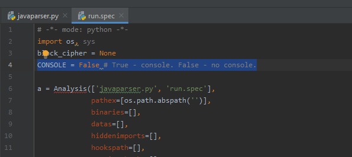
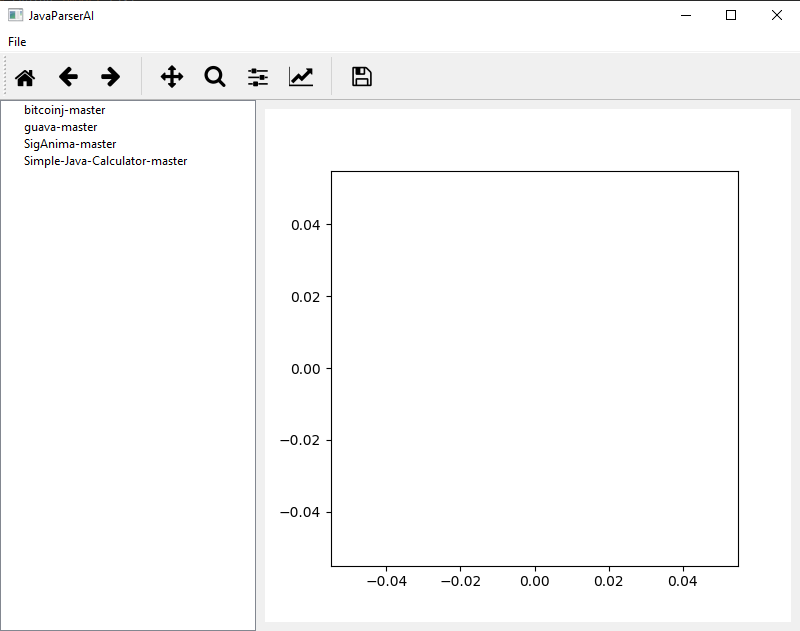
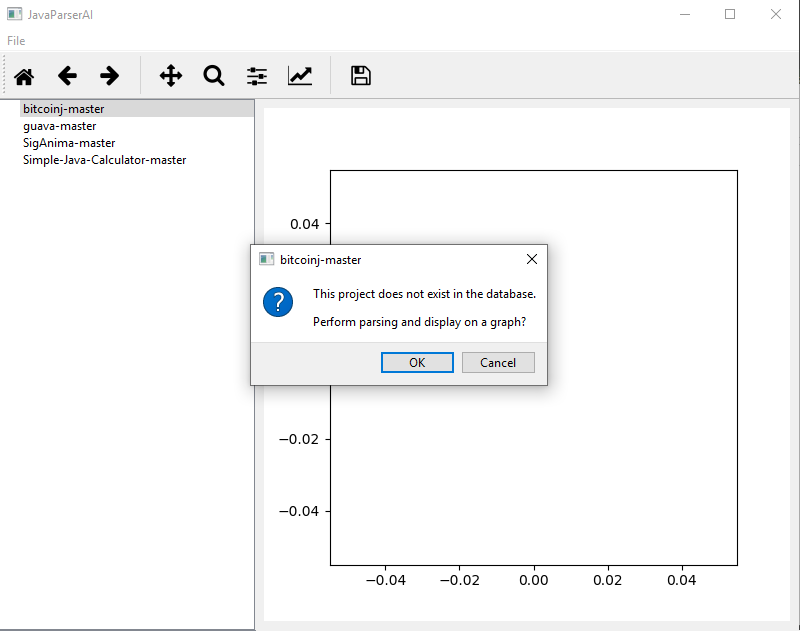
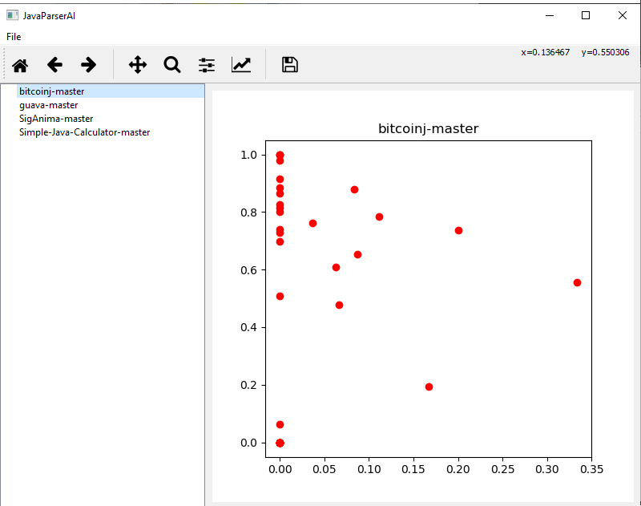
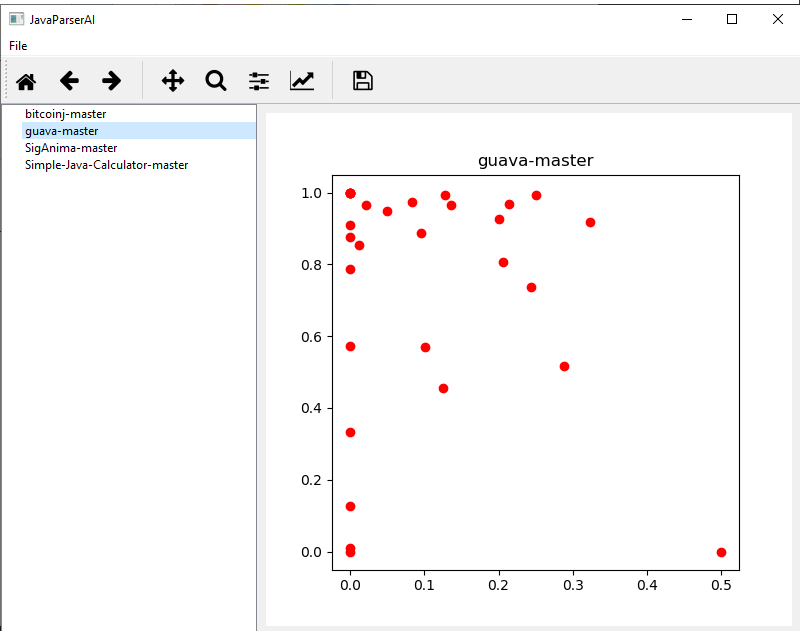
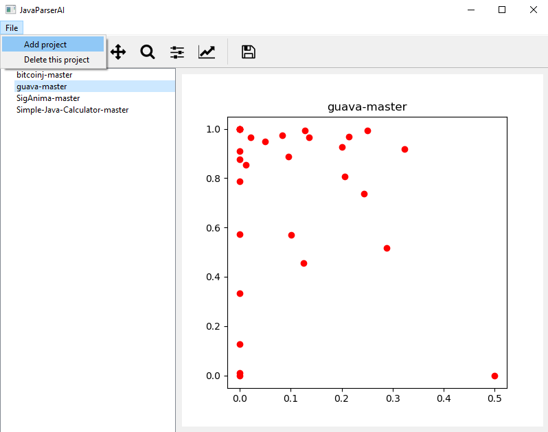
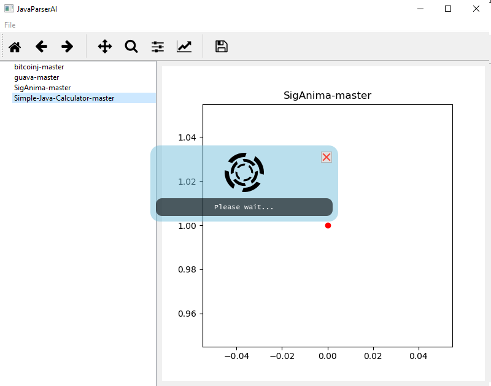

# JavaParserAI
____
# Getting started
To run the application you need to install dependencies:
```
pip3 install -r requirements.txt
```
1. matplotlib <= 3.0.3
2. pyqt5 <= 5.12

To start the application, you need to run the command from the root directory:
```
python3 javaparser.py
```

# Build application

Windows
-------
To activate the console in the assembled application, you need to change the `'CONSOLE'` parameter.


Build:
```
pyinstaller run.spec
```

# Example














16MLTQ8tmsj8EDdY8mb6aEqaB6hLvsHozq